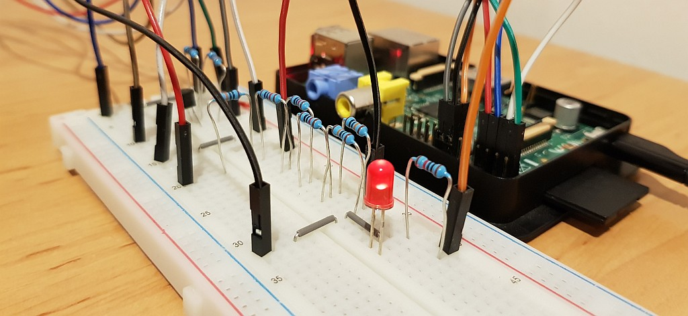

*This is **not** a release version of the README! Please follow [this link](https://github.com/RhinoDevel/cbmtapepi/blob/v1.7.0/README.md) to get to the README of **CBM Tape Pi**'s latest stable release version ([v1.7.0](https://github.com/RhinoDevel/cbmtapepi/releases/tag/v1.7.0)).*

# CBM Tape Pi
*Marcel Timm, RhinoDevel, 2021, [rhinodevel.com](http://rhinodevel.com/)*



Use a Raspberry Pi as fast storage device with your Commodore 8-bit computer (CBM/PET, VIC 20, C64, etc.) via tape port connector!

The main goal was to provide such a solution for the **CBM/PET** machines with as less hardware effort as possible while using Open Source software, the Raspberry Pi and the Commodore's datassette port, only.

- Latest release: [CBM Tape Pi v1.7.0](https://github.com/RhinoDevel/cbmtapepi/releases/tag/v1.7.0)

- Older/outdated video (slow compatibility mode, v1.6.1): [CBM 3032 (please excuse the cuts, there was no fast mode, yet..)](https://youtu.be/CkLR3lkHjh4)

## Features

- Access Pi's SD card from your Commodore to:
  - Load PRGs.
  - Save PRGs.
  - Traverse directories.
  - List current directory's content.
  - Delete files.
  - **Fast mode** via wedge for CBM/PET, VIC 20 and C64.
  - Compatibility mode for all machines listed above and maybe more (C16, etc. - untested).

- Easy to build hardware interface:
  - No ICs, just a minimum amount of discrete components.
  - Only five connections need to be soldered (wires on the tape port plug).

## Requirements

You need:

- Some cables (not that many, if you want to solder).
- 1x breadboard (if you do not want to solder) or a circuit board. Alternative use a PCB via [Sven Petersen's layout](https://github.com/svenpetersen1965/CBM-Tape-Pi-PCB)!
- 1x LED.
- 3x NPN transistor (e.g. a BC547 or a PN2222A).
- 1x PNP transistor (e.g. a BC557).
- 10x 10k Ohm resistors (two of these are used to get a 20k Ohm resistor). Optionally replace R1 (LED series resistor) with a lower value resistor to let the LED burn brighter.
- 1x Commodore cassette port plug.
- 1x Raspberry Pi 1, 2, 3 or Zero (other models may also work, not tested, yet).
- 1x SD card supported by your Raspberry Pi.
- Optional: A push button (to be able to soft-reset the Raspberry Pi).

## Warning and disclaimer

- When using CBM Tape Pi, **don't** toggle the Commodore datassette connector ports that are (by Commodore default) used as inputs into output mode and vice versa (e.g. via POKEs), because that can cause damage to your Raspberry Pi or even to your precious Commodore (this is nothing special, it should also never be done, if a real datassette device is attached)!
- **I take no responsibility** for any damage caused by using CBM Tape Pi. But: I am sure that, if you follow this README and make no mistakes, there will be **no** damage.

## Preparations

1) Setup connections (see [picture](./docs/CBM%20tape%20to%20Raspberry%20Pi%20(Marcel%20Timm%2C%20RhinoDevel).png) below).
2) Put compiled kernel.img (or kernel7.img for Raspberry Pi 2 and 3) from **latest release** [v1.7.0](https://github.com/RhinoDevel/cbmtapepi/releases/tag/v1.7.0) on the first FAT32 partition on an SD card with MBR partition table (easiest way is to use an SD card having Raspbian installed).
3) Delete (if existing) config.txt and cmdline.txt from boot partition.
4) Overwrite fixup.dat, start.elf and bootcode.bin with the files having the same names from [Raspberry Pi firmware release 1.20171029](https://github.com/raspberrypi/firmware/tree/1.20171029/boot). 

## The LEDs

- The Pi's ACT LED will flash every second to show that CBM Tape Pi is running.
- The interface's LED will be on, if waiting for commands.
- The interface's LED will be off during transfer of a PRG to Commodore.
- The interface's LED will flash to indicate an error that occurred during last command execution (e.g. file not found), but it will still wait for the next command from the Commodore.

## How to use CBM Tape Pi

1) (Always) power-on Raspberry Pi first.
2) Power-on Commodore.
3) Enter commands (see below for details).
4) (Always) power-off Commodore first.
5) Power-off Raspberry Pi. 

Do not power-off the Raspberry Pi while Commodore machine is still on.

If you need to reset the Raspberry Pi, I recommend to also first power-off the
Commodore, although keeping the Commodore running during Raspberry Pi reset
should do no harm. 

## How to enter and use fast mode

After the first start of CBM Tape Pi it is in (slow) compatibility mode (see below).

You can toggle to another mode from compatibility mode this way:

1) Enter ```SAVE"MODE <mode name>"``` where you replace ```<mode name>``` with one of the following strings:
  - ```PET1```: CBM/PET, BASIC v1, fast mode, wedge installed in tape buffers.
  - ```PET2```: CBM/PET, BASIC v2, fast mode, wedge installed in tape buffers.
  - ```PET4```: CBM/PET, BASIC v4, fast mode, wedge installed in tape buffers.
  - ```PET1TOM```: CBM/PET, BASIC v1, fast mode, wedge installed at top of BASIC memory.
  - ```PET2TOM```: CBM/PET, BASIC v2, fast mode, wedge installed at top of BASIC memory.
  - ```PET4TOM```: CBM/PET, BASIC v4, fast mode, wedge installed at top of BASIC memory.
  - ```VIC20```: VIC 20, fast mode, wedge installed at top of BASIC memory.
  - ```C64```: C64, fast mode, wedge installed at top of free high memory (right before address $D000).
  - ```C64TOM```: C64, fast mode, wedge installed at top of BASIC memory.

2) Power-off Commodore.
3) Reset Raspberry Pi.
4) Power-on Commodore.
5) Enter ```LOAD```.
6) Follow start instruction shown at Commodore (as file name) to install wedge, e.g. ```RUN``` or ```SYS 655```.

- If ```RUN``` is shown, using ```<shift> + <run/stop>``` instead of ```LOAD``` followed by ```RUN``` would also have worked.

**You have reached fast mode!**

Feel free to enter all commands described below for compatibility mode, but now use ```!``` character followed by command (instead of using ```SAVE``` and ```LOAD```). E.g. to load a PRG: ```!MYCBMAPP.PRG```

**Hint**: Change the mode when fast mode is active:
- Enter ```!MODE <mode name>``` to let the Pi be in another mode from the next start on.
- Switch back to compatibility mode with ```!MODE SAVE```.

## How to use compatibility mode

- The commands to the Pi will be send via Commodore SAVE command (no need for a wedge).
- If you have a (big) PRG loaded in memory, consider executing ```NEW``` before ```SAVE```, to avoid that the PRG will unnecessarily be sent to the Pi.
- **Hint**: The same commands described below are used in fast mode. Just enter the ```!``` character followed by the command (instead of using ```SAVE``` and ```LOAD```). E.g. to load the directory contents in fast mode enter: ```!$```
- **LOAD**: E.g. a PRG file named ```mycbmapp.prg```:

  ```
      SAVE"MYCBMAPP.PRG":LOAD
      RUN
  ```
  For non-relocatable (non-BASIC) PRGs on a VIC 20 or a more recent machine (e.g. a C64):

  ```
      SAVE"MYCBMAPP.PRG":LOAD,1,1
      ...
  ```
- **SAVE**: E.g. a PRG file named ```mynewapp```:

  ```
      SAVE"+MYNEWAPP"
  ```
- **LIST**: List content of current directory:

  ```
      SAVE"$":LOAD
      RUN
  ```
- **CD**: Change directory, e.g. to subfolder named "petprgs":

  ```
      SAVE"CD PETPRGS"
  ```
  To return from a subfolder type:

  ```
      SAVE"CD .."
  ```
- **RM**: Remove a file, e.g. the file named "oldfile.prg":

  ```
      SAVE"RM OLDFILE.PRG"
  ```
- **MODE**: Toggle mode (also see options, above), e.g. to CBM/PET BASIC v4 fast mode:

  ```
      SAVE"MODE PET4"
  ```

## Connections
Connect Raspberry Pi and Commodore machine this way:
.png)

- [Raspberry Pi GPIO connections](./docs/CBM%20Tape%20Pi%20-%20Raspberry%20Pi%20GPIO%20connections.png)
- [Commodore tape port connections](./docs/CBM%20Tape%20Pi%20-%20Commodore%20machine%20cassette%20port%20connections.png)

## Supported Commodore machines

- CBM/PET computers (tested with BASIC v1, v2 & v4 on a 2001 and a 3032, tested with BASIC v4 on an 8032-SK).
- VIC 20.
- C64.
- Other Commodore computers with tape interface (C16, etc. - not tested, yet).

## Supported Raspberry Pis

- Raspberry Pi 1 (successfully tested with Pi 1 Model B).
- Raspberry Pi 2 (successfully tested with Pi 2 Model B v1.1).
- Raspberry Pi 3 (successfully tested with Pi 3 Model B v1.2).
- Raspberry Pi Zero (successfully tested with Pi Zero W v1.1).
- Other Raspberry Pis (not tested, yet).

## Next project goals

- Support loading PRG files with filenames longer than 12 characters.
- List directory content without erasing possibly existing PRG in memory when using fast mode.
- Show destination memory addresses and sizes of PRG files in directory listing.
- Increase loading speed for fast mode wedges, if top-of-memory shall be used.
- Show a result text on Commodore machine for at least some commands in fast mode. 
- Read/write from/to tape storage files like TAP, etc.
- Read/write from/to USB storage device.
- New command: "md" to create a folder.
- Automatically create a folder (if missing) and use it as "root" (e.g. "CBMTAPEPI").
- Probably impossible, at least for compatibility mode (kernel module - timer interrupt handler or DMA usage?): Raspbian port of CBM Tape Pi, see [Linux README](./linux/README.md).


